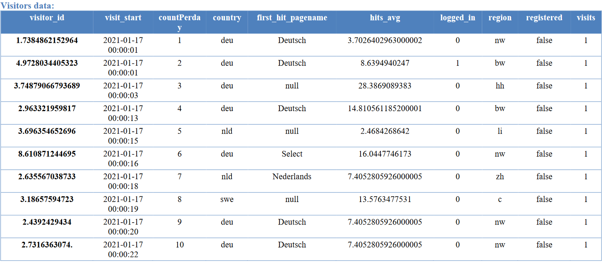
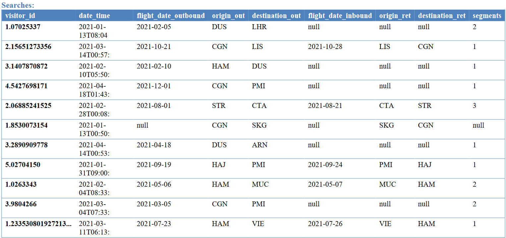
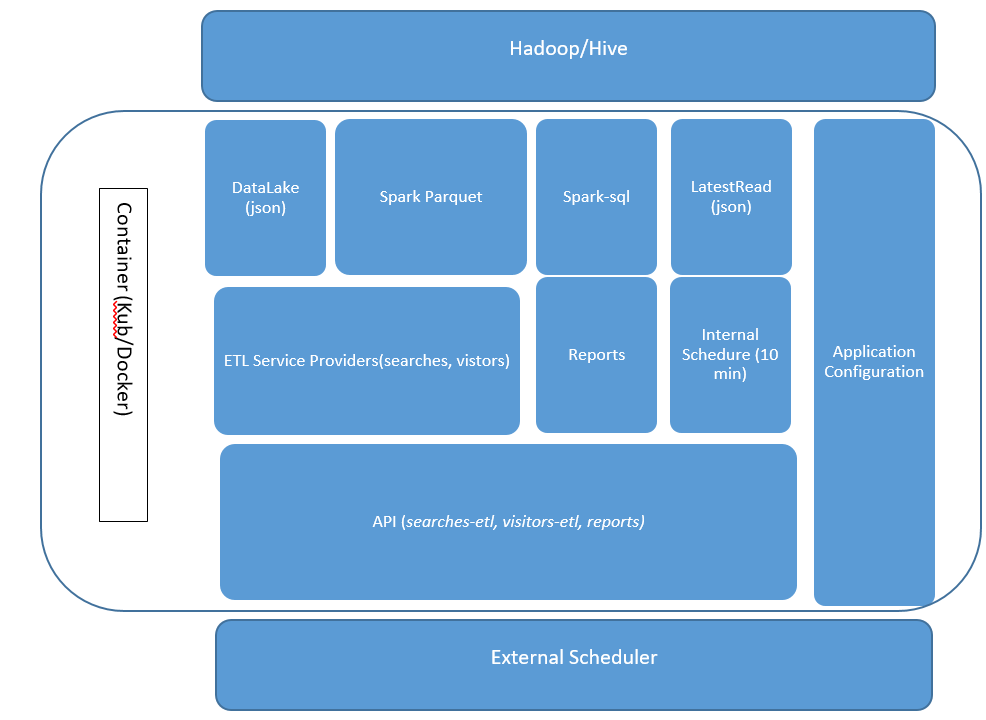

#  Welcome to Eurowings Data Engineering Challenge Practical Assignment v0.4.15 #

Updated 15th Feb 2022

Author : <a href="mailto:adramazany@gmail.com">Adel Ramezani</a>

[comment]: <> (![image]&#40;https://img.shields.io/pypi/v/python-binance.svg&#41;)
[comment]: <> (<a href="https://img.shields.io/pypi/">link</a>)

## Description ##
To improve our website personalization platform, we would like to have a platform to handle the large-scale data we are retrieving from our web page and our
mobile app via FTP in a daily batch.
### Task ####
You get two data samples which were generated from our website. However, in their current state, they are not suitable to be used right away by our Data
Scientists and Data Analysts who want to focus on the model building without having to modify the data much further. Your task is now the following:
Overall Goal:
you should write a code which injects these data daily into a datalake in a proper structure.
This assignment sheet consists of three tasks. Please do your coding in any framework, engine or library that you think is sufficient. Then create a directoy in
the root directory of your project and name it as DataLake. We will assume this as the data lake which you inject the data in it.
You don’t need to send us any data, code and documentation is enough.
There are two series of json files attached to the assignment with the following structures:

#### Task 1: Data Ingestion ####
Your code should read all the files that are given in this assingment and then based on the timestamp of each file's name, write them into the datalake with your
desired format. Be aware that the pipeline could be accidentally triggered multiple times in a day. Please write a short description why you chose the exported
format.

* Why I choose spark?
    - Spark handles work in a similar way to Hadoop, except that computations are carried out in memory and stored there, Hadoop is used mainly for disk-heavy operations and Spark is a more flexible.
    - I already prepared the feature of using hadoop for storing huge amount of data.
*  why you chose the parquet format?
    - Parquet and ORC both store data in columns and are great for reading data, making queries easier and faster by  compressing data and retrieving data from specified columns rather than the whole table. Parquet and ORC also offer higher compression than Avro.
    - Parquet is ideal for big data
    - Parquet offers flexible compression options and efficient encoding schemes
    - Parquet support for Amazon Redshift
    - Twice as fast and with six times more compression than text files
    - The default file format for Spark is Parquet

#### Task 2: Preprocessing ####
For this task, the data you now have in the datalake should be processed and cleansed.
We are interested to know more about which changes you will perform, why and which format and structure you have chosen for this task.
Remember, these are some sample files, but every hour, our systems generate big amounts of data and every optimization could help us to optimize and
increase the performance. You can take into consideration some dimension tables(enums) for some columns as extra points.

* which changes made to data?
    - Everywhere I had date field, I changed it to date type, Because of Standardization and Flexibility
    - I created date field from visitors.visit_start, And resolved mismatch of two exists format in that field.
    - I changed the flight_date_outbound, flight_date_inbound fields type in searches to date.
    - I think fields like country, region, origin_out, destination_out, origin_ret, destination_ret does not need to change or dimension tables.  
    - IMPROVEMENT : I'll create dimension table for page names and replace first_hit_pagename with the id of dimension table.
    
    

#### Task3: Reports ####
For this task we would like to have a simple report which shows number of searches per region, country and date (not date time). For this report you need, first
to join the datasets. To make the join faster and more accurate, we assume that the region of a visitor in visitors dataset will not change on daily basis. Then,
you should first get the latest entry of each visitor per day and later perform the join with searches dataset.

#### Task4: Pipeline architecture ####
Assuming you get multiple large datasets every 10 minutes, how do you automatize this task? Which tools, which strategy would you use? Please give us only
a simple architecture, including the infrastructure of your desired system.

* How do you automatize get multiple large datasets every 10 minutes?
    - I prepare Configurable Internal Scheduler to automatically execute this job, It could be disabled by setting 0 to config.etl_scheduler_interval_minutes
    - Also I developed /searches and /visitors APIs to prepare this feature to External Schedulers like CronTab, AWS Cron Jobs, Apache Airflow or any other Job Scheduler.
* Which tools?
    - I used APScheduler to prepare Internally, And I used flask, flask_cors, flask_restful to prepare API for external calls
* Which strategy would you use?
    - I prefer using External Scheduler, Because of flexibility and their extra features, So I prepare both strategy Internal and External.
* Please give us only a simple architecture, including the infrastructure of your desired system
    - It is a microservice
    - It can be deployed just one instance or multiple instance,
    - It can be executed in OS or in Containers like kubernetes
    - If it deployed in multiple instance, It must configure to using remote hive machine by config.hive_metastore_uris
    - It should have internal scheduler to processing
    - It should have API for calling etl process externally, That enable external scheduler feature
    - It must be configurable to enable us to easily change way of execution, 
    - It must be based on High Performance Apache Spark technology
    - Spark could be configured to using cluster modes like YARN, Mesos
    - IMPROVEMENT : It is very good to having Message Queue behind APIs and in front of etl processes to resolve concurrency in calling APIs 
    

#### Bonus Task ####

* An implementation of the described architecture from task 4 would be considered as a bonus task
    - I prepare the described architecture as much as possible in time frame

* Dockerizing the project, which everything can be triggered inside the docker, would be considered as a bonus.
    - I prepare docker file for Dockerizing the project 

### Syntax:
    python app.py 

### Future Improvements
+ Logging
+ exception handling
+ api Test case
+ runtime arguments
+ store and monitor execution or failed jobs
+ MessageQueue
